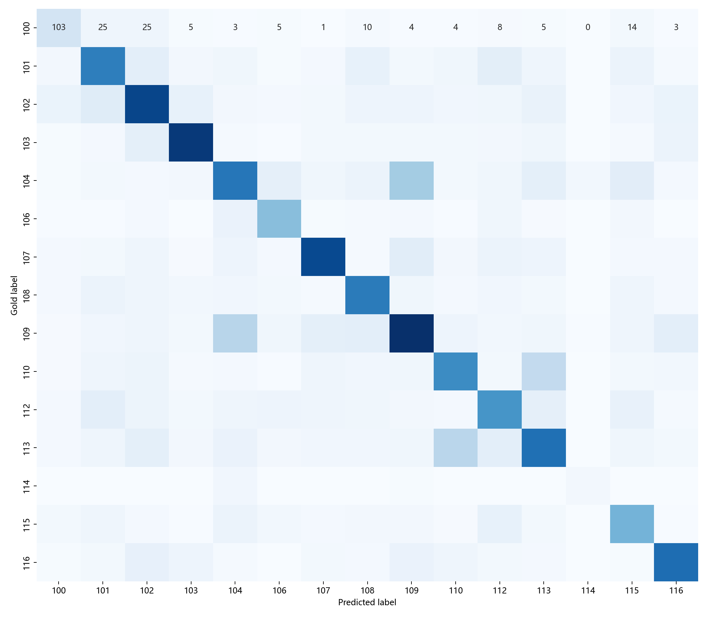

# 融合词级与字级 TF-IDF 特征的中文新闻文本挖掘系统设计与实现

## 摘要

随着互联网新闻、问答社区和社交媒体内容数量不断增长，如何从大规模短文本中自动识别文本类别、发现热点主题并完成相似内容检索，已经成为文本挖掘领域的重要任务。本文设计并实现了一个面向中文新闻标题的文本挖掘系统。系统以 CLUE Benchmark 中的 TNEWS 中文新闻分类数据集为实验对象，围绕新闻文本分类、主题发现、关键词抽取和相似文本检索四个任务展开。分类模块采用词级 TF-IDF 与字级 TF-IDF 融合特征，并使用线性支持向量机完成多类别新闻分类；对比模块使用词级 TF-IDF 与 Logistic Regression 构建基线模型；主题模块采用非负矩阵分解发现文本集合中的潜在主题；检索模块基于 TF-IDF 向量和余弦相似度返回相似标题。实验在 53360 条训练样本和 10000 条验证样本上进行，主模型 Accuracy 为 0.5526，Macro-F1 为 0.5385，Weighted-F1 为 0.5527，优于词级 Logistic Regression 基线。除离线实验外，系统还提供 Streamlit 演示页面，支持用户输入新闻标题并查看预测类别、类别得分、相似文本和主题词结果。实验表明，传统机器学习方法在中文短文本多分类任务中能够形成稳定、可解释、易部署的文本挖掘基线，但在语义相近类别和极短文本场景下仍存在一定局限。

关键词：文本挖掘；中文新闻分类；TF-IDF；线性支持向量机；主题模型；相似检索

## 1 引言

文本挖掘是从非结构化文本中发现有价值信息的过程，常见任务包括文本分类、聚类、主题发现、关键词抽取、情感分析、信息检索和文本相似度计算。相比结构化数据，文本数据具有维度高、噪声多、语义表达灵活等特点，因此需要专门的文本表示和机器学习方法。

新闻标题是典型的短文本数据。一方面，标题通常浓缩了新闻的核心事件，具有较高的信息密度；另一方面，标题长度较短，包含的上下文有限，容易出现词义不完整、实体词变化快、类别边界模糊等问题。例如“区块链投资心得，能做到就不会亏钱”既包含科技词汇“区块链”，也包含财经语境“投资”“亏钱”；“以色列大规模空袭开始”既可以被理解为军事新闻，也可能被归入国际新闻。这类现象使得中文短文本分类比普通长文本分类更具挑战。

本课程作业要求完成一个文本挖掘领域的系统或算法，并提交论文形式的实验报告、源代码和数据集链接。为了避免项目过于简单，本文没有只做单一分类任务，而是围绕中文新闻标题构建了一个完整的小型文本挖掘系统。系统不仅能完成新闻类别预测，还能输出潜在主题、关键词、相似文本和模型重要特征，从而覆盖监督学习、无监督学习和信息检索三个方向。

本文的主要工作如下：

1. 构建了中文新闻标题文本挖掘工程，包含数据读取、中文预处理、分类建模、主题发现、关键词抽取、相似检索和 Web 演示模块。
2. 设计了融合词级与字级 TF-IDF 的特征表示方法，用于缓解中文分词误差和短文本信息不足的问题。
3. 使用线性 SVM 完成 15 类新闻标题分类，并与词级 TF-IDF + Logistic Regression 基线进行比较。
4. 使用 NMF 主题模型发现文本集合中的高频语义主题，并结合重要特征分析模型的可解释性。
5. 通过 Streamlit 实现交互式系统展示，使实验结果可以被直接演示和复现。

## 2 相关技术

### 2.1 中文文本预处理

中文文本与英文文本的一个显著区别是词语之间没有天然空格。因此，在使用词袋、TF-IDF 等传统文本表示方法之前，通常需要进行中文分词。本文采用 jieba 分词工具对标题文本进行切分，并结合简单停用词表过滤低信息量词语。预处理过程主要包括：

1. 去除 URL、特殊符号和多余空白。
2. 保留中文、英文和数字字符。
3. 使用 jieba 进行中文分词。
4. 过滤单字词、纯数字词和常见停用词。

这种预处理方式实现简单、速度较快，适合课程项目和传统机器学习基线。

### 2.2 TF-IDF 文本表示

TF-IDF 是文本挖掘中常用的统计特征表示方法。TF 表示词语在当前文档中的出现频率，IDF 表示词语在语料库中的区分能力。若某个词在当前文档中频繁出现，但在其他文档中较少出现，则该词通常具有较高的 TF-IDF 权重。

其基本思想可以表示为：

```text
tfidf(t, d) = tf(t, d) * idf(t)
```

其中 `t` 表示词项，`d` 表示文档。本文同时使用词级 TF-IDF 和字级 TF-IDF。词级特征可以保留较完整的语义词，如“世界杯”“高考”“股票”；字级特征则可以捕捉连续字符片段，如“人工智”“新能源”“上市公”，在分词结果不理想或标题很短时仍能提供信息。

### 2.3 线性分类模型

线性 SVM 和 Logistic Regression 都是文本分类中常见的传统机器学习模型。由于 TF-IDF 特征维度高且稀疏，线性模型通常具有训练速度快、泛化稳定、结果可解释等优点。线性 SVM 通过最大化分类间隔学习决策边界，适合高维稀疏文本特征；Logistic Regression 则直接建模类别概率或类别得分，常作为文本分类基线。

对于多类别分类任务，模型会学习每个类别对应的权重向量。给定文本向量 `x`，类别 `c` 的得分可表示为：

```text
score_c(x) = w_c * x + b_c
```

最终选择得分最高的类别作为预测结果。

### 2.4 NMF 主题发现

非负矩阵分解是一种常见的无监督主题建模方法。给定文档-词项矩阵 `V`，NMF 将其分解为两个非负矩阵：

```text
V ≈ W * H
```

其中 `W` 表示文档在主题上的权重，`H` 表示主题在词项上的权重。对 `H` 的每一行取权重最高的若干词，就可以得到对应主题的代表词。相比纯粹的聚类编号，主题词更容易被人工理解和解释。

### 2.5 文本相似检索

相似文本检索是信息检索中的基础任务。本文将新闻标题转化为 TF-IDF 向量，并使用余弦相似度计算查询文本与候选文本之间的相似程度：

```text
sim(a, b) = (a * b) / (||a|| ||b||)
```

余弦相似度关注向量方向而不是绝对长度，适合处理标题这种长度差异较小但词项稀疏的文本数据。

## 3 数据集

### 3.1 数据来源

实验使用 CLUE Benchmark 的 TNEWS 中文新闻分类数据集。数据集公开发布在 Hugging Face 和 CLUE 官方项目中。

- 数据集链接：https://huggingface.co/datasets/clue/clue
- 官方项目链接：https://github.com/CLUEbenchmark/CLUE
- 使用子集：`tnews`
- 数据类型：中文新闻标题
- 任务类型：短文本多类别分类

由于作业要求“不要直接上传数据集”，本项目不上传完整原始数据，而是在 README 中提供公开数据集链接，并通过脚本自动下载。仓库中仅保留 `data/sample_tnews.csv` 作为环境测试的小样例。

### 3.2 数据规模与划分

本实验使用 Hugging Face 版本的 `clue/clue` 数据集，其中 TNEWS 子集包含 train、validation 和 test 划分。由于 test 集没有公开标签，实验使用 train 作为训练集，validation 作为验证集。

| 划分 | 样本数 | 用途 |
| --- | ---: | --- |
| train | 53360 | 模型训练、主题发现、关键词抽取 |
| validation | 10000 | 模型评估、误差分析 |
| test | 10000 | 官方测试集，未用于本文指标计算 |

验证集共有 15 个类别。Hugging Face 版本中的类别以 `100`、`101`、`102` 等编号形式提供，因此本文在实验结果中保留原始类别编号，避免自行改名造成歧义。

### 3.3 数据特点

从数据样例可以看到，TNEWS 标题具有以下特点：

1. 文本较短，大多数标题只包含一句话。
2. 新闻领域跨度较大，包含娱乐、体育、财经、教育、科技、军事、国际、旅游、汽车、游戏等内容。
3. 部分标题接近问答或观点表达，句式不像传统新闻标题，例如“为什么现在很多人喜欢...”“如何看待...”，这会增加分类难度。
4. 部分类别之间存在词汇重叠，例如财经、股票、科技都可能出现“投资”“公司”“上市”等词。
5. 类别样本数量不完全均衡，例如验证集中类别 `114` 仅有 45 条样本，远少于其他类别。

这些特点决定了本任务不能只依赖简单关键词规则，需要使用统计特征和机器学习模型。

## 4 系统设计

### 4.1 总体架构

系统采用模块化设计，主要包含七个部分：

| 模块 | 文件 | 功能 |
| --- | --- | --- |
| 数据读取 | `src/text_mining_system/data.py` | 读取样例数据、本地 CSV 或 Hugging Face TNEWS 数据 |
| 文本预处理 | `src/text_mining_system/preprocess.py` | 文本清洗、分词、停用词过滤 |
| 分类模型 | `src/text_mining_system/models.py` | 构建 TF-IDF + 线性模型，输出评估指标和重要特征 |
| 主题发现 | `src/text_mining_system/topics.py` | 使用 NMF 挖掘主题，使用 TF-IDF 抽取关键词 |
| 相似检索 | `src/text_mining_system/similarity.py` | 构建 TF-IDF 相似度索引并返回相似标题 |
| 实验入口 | `scripts/run_experiment.py` | 一键运行训练、评估、绘图和结果保存 |
| 演示系统 | `app.py` | Streamlit 页面，支持分类预测、相似检索和主题展示 |

这种设计将算法逻辑与实验脚本分开，便于扩展模型、替换数据集或增加新的可视化页面。

### 4.2 系统流程

系统的完整流程如下：

1. 读取 TNEWS 数据集，提取标题文本和类别标签。
2. 对标题进行清洗和分词。
3. 构建词级 TF-IDF 和字级 TF-IDF 特征。
4. 训练分类模型，并在验证集上预测类别。
5. 计算 Accuracy、Macro-F1、Weighted-F1 和混淆矩阵。
6. 保存分类报告、预测结果、混淆矩阵图和模型文件。
7. 使用训练集文本进行 NMF 主题发现和关键词抽取。
8. 构建相似文本检索索引。
9. 通过 Streamlit 页面提供交互式演示。

### 4.3 可复现性设计

为了保证实验可复现，代码中固定了随机种子，并将训练参数写入脚本。运行命令会自动生成同名结果文件夹，保存以下产物：

- `metrics.json`：总体指标。
- `classification_report.csv`：每个类别的 precision、recall、F1 和 support。
- `confusion_matrix.csv`：混淆矩阵原始数据。
- `confusion_matrix.png`：混淆矩阵图片。
- `predictions.csv`：验证集逐条预测结果。
- `topics.csv`：NMF 主题词。
- `keywords.csv`：样本文本关键词。
- `top_features.csv`：各类别重要特征。
- `model.joblib`：训练好的模型文件。

## 5 方法设计

### 5.1 文本清洗与分词

预处理函数首先将输入转为字符串，然后使用正则表达式去除 URL 和特殊符号，只保留中文、英文和数字。清洗后的文本使用 jieba 分词，并过滤低信息量词语。由于 TNEWS 中许多标题包含专有名词、明星名、地名、公司名和网络词，本文没有使用过大的停用词表，以避免误删有判别力的词。

### 5.2 词级 TF-IDF 特征

词级特征使用 jieba 分词结果作为 token，设置 `ngram_range=(1, 2)`，同时保留 unigram 和 bigram。这样可以同时捕捉单个词和相邻词组合。例如：

- “高考”可以作为单词特征。
- “新能源 汽车”可以作为 bigram 特征。
- “股票 交易”可以作为财经相关组合特征。

词级特征的优点是可解释性强，后续可以直接输出每个类别权重最高的词作为模型解释。

### 5.3 字级 TF-IDF 特征

字级特征使用 2 到 4 字符 n-gram。中文短文本中，分词错误或未登录词可能导致关键信息丢失。字级 n-gram 不依赖分词，因此可以捕捉“世界杯”“人工智能”“区块链”等连续字符片段。本文将字级特征与词级特征拼接，得到混合表示：

```text
x = [TFIDF_word(text), TFIDF_char(text)]
```

在实现中，词级 TF-IDF 最大特征数设置为 60000，字级 TF-IDF 最大特征数设置为 80000，均使用 sublinear TF 以降低高频词对模型的过强影响。

### 5.4 分类模型

主模型为 `hybrid_svm`，即词级 TF-IDF + 字级 TF-IDF + LinearSVC。模型参数如下：

| 参数 | 设置 |
| --- | --- |
| 分类器 | LinearSVC |
| C | 0.5 |
| class_weight | balanced |
| random_state | 42 |
| 词级 n-gram | 1 到 2 |
| 字级 n-gram | 2 到 4 |

基线模型为 `word_lr`，即词级 TF-IDF + Logistic Regression。它只使用词级特征，可以用于观察字级特征和 SVM 对结果的提升。

### 5.5 主题发现与关键词抽取

主题发现模块使用训练集文本构建词级 TF-IDF 矩阵，再使用 NMF 分解为 8 个主题。每个主题选取权重最高的 12 个词作为代表词。关键词抽取则对样本文本计算 TF-IDF 权重，并为每条文本返回权重最高的若干词。

### 5.6 相似文本检索

相似检索模块使用词级 TF-IDF 构建索引。用户输入查询文本后，系统将查询转化为向量，并与库中所有标题计算余弦相似度，返回得分最高的若干条记录。该模块适合用于新闻去重、推荐召回或相似案例查询。

## 6 实验设置

### 6.1 运行环境

本项目使用 Python 实现，主要依赖如下：

| 依赖 | 用途 |
| --- | --- |
| pandas / numpy | 数据处理 |
| scikit-learn | TF-IDF、分类模型、评估指标、NMF |
| jieba | 中文分词 |
| matplotlib / seaborn | 混淆矩阵可视化 |
| datasets | 下载 Hugging Face 数据集 |
| streamlit | 系统演示页面 |
| joblib | 模型保存 |

### 6.2 实验命令

主模型实验命令如下：

```bash
python scripts/run_experiment.py --dataset clue-tnews --max-train 53360 --max-eval 10000 --classifier hybrid_svm --output results/tnews_full
```

基线模型实验命令如下：

```bash
python scripts/run_experiment.py --dataset clue-tnews --max-train 53360 --max-eval 10000 --classifier word_lr --output results/tnews_word_lr
```

演示系统启动命令如下：

```bash
streamlit run app.py
```

### 6.3 评价指标

本文使用以下指标评价分类效果：

1. Accuracy：所有样本中预测正确的比例，反映整体分类准确率。
2. Precision：预测为某类的样本中真正属于该类的比例。
3. Recall：某类真实样本中被正确识别的比例。
4. F1-score：Precision 和 Recall 的调和平均。
5. Macro-F1：对各类别 F1 直接平均，更关注小类别表现。
6. Weighted-F1：按类别样本数加权平均，更接近整体样本分布。
7. Confusion Matrix：观察类别之间的混淆情况。

在类别不均衡时，仅看 Accuracy 容易忽略小类别，因此本文重点同时报告 Macro-F1 和 Weighted-F1。

## 7 实验结果

### 7.1 总体结果

完整实验使用 53360 条训练样本和 10000 条验证样本。主模型与基线模型结果如下。

| 模型 | 特征 | Accuracy | Macro-F1 | Weighted-F1 |
| --- | --- | ---: | ---: | ---: |
| Logistic Regression | 词级 TF-IDF | 0.5357 | 0.5215 | 0.5374 |
| Linear SVM | 词级 + 字级 TF-IDF | 0.5526 | 0.5385 | 0.5527 |

从结果可以看出，融合词级和字级特征的 Linear SVM 在 Accuracy 和 Weighted-F1 上略高于词级 Logistic Regression。虽然提升幅度不大，但说明字级 n-gram 对中文短标题存在补充作用，尤其在标题分词不稳定、实体词较多或词语组合较短时，字级特征能够提供额外信息。

### 7.2 各类别指标

主模型在验证集上的分类报告如下。

| 类别 | Precision | Recall | F1-score | Support |
| --- | ---: | ---: | ---: | ---: |
| 100 | 0.4008 | 0.4791 | 0.4364 | 215 |
| 101 | 0.5360 | 0.5367 | 0.5363 | 736 |
| 102 | 0.5571 | 0.5681 | 0.5626 | 910 |
| 103 | 0.7348 | 0.7080 | 0.7211 | 767 |
| 104 | 0.4773 | 0.4289 | 0.4518 | 956 |
| 106 | 0.5492 | 0.6349 | 0.5890 | 378 |
| 107 | 0.6873 | 0.6448 | 0.6654 | 791 |
| 108 | 0.5696 | 0.6207 | 0.5941 | 646 |
| 109 | 0.5377 | 0.5170 | 0.5272 | 1089 |
| 110 | 0.5142 | 0.5070 | 0.5105 | 716 |
| 112 | 0.4893 | 0.4964 | 0.4928 | 693 |
| 113 | 0.4868 | 0.4674 | 0.4769 | 905 |
| 114 | 0.3556 | 0.3556 | 0.3556 | 45 |
| 115 | 0.4686 | 0.5445 | 0.5037 | 494 |
| 116 | 0.6570 | 0.6510 | 0.6540 | 659 |

类别 `103` 的 F1 值最高，达到 0.7211，说明该类文本具有较明显的判别词。根据模型重要特征，类别 `103` 中权重较高的词包括 `nba`、`球迷`、`中超`、`哈登`、`火箭`、`球员` 等，说明其主题边界较清晰。类别 `114` 的 F1 值最低，为 0.3556，原因之一是验证集 support 只有 45 条，样本量过少导致模型难以学习稳定特征。

### 7.3 混淆矩阵

混淆矩阵如下图所示。



从混淆矩阵和预测样例可以看出，模型主要在语义接近类别之间发生错误。例如，军事类和国际类标题经常同时出现国家、军队、冲突等词；科技类和财经类标题都可能出现公司、投资、亏损、区块链等词；房产类和农业/农村类在涉及“拆迁”“农村住房”等标题时也容易混淆。

### 7.4 主题发现结果

NMF 主题模型在训练集上发现的 8 个主题如下。

| 主题编号 | 代表词 |
| ---: | --- |
| 0 | 上联 / 下联 / 黄山 / 泰山 / 赵本山 / 如何 / 求下联 / 双肩挑 / 世俗 / 怎么 / 春风 / 芳草 |
| 1 | 什么 / 到底 / 区别 / 时候 / 意思 / 现在 / 农村 / 需要 / 原因 / 手机 / 程度 / 比较 |
| 2 | 为什么 / 那么 / 这么 / 现在 / 喜欢 / 日本 / 很多 / 农村 / 越来越 / 不能 / 不是 / 俄罗斯 |
| 3 | 如何 / 看待 / 评价 / 联想 / 杨元庆 / 应该 / 总裁 / 选择 / 手机 / 自己 / 发展 / 应对 |
| 4 | 中国 / 日本 / 世界 / 印度 / 怎么样 / 我们 / 国家 / 游客 / 城市 / 企业 / 哪个 / 第一 |
| 5 | 怎么 / 手机 / 老师 / 看待 / 大家 / 学生 / 春风 / 家长 / 一夜 / 这种 / 如果 / 发票 |
| 6 | 美国 / 如果 / 伊朗 / 协议 / 俄罗斯 / 退出 / 特朗普 / 伊核 / 以色列 / 多久 / 世界 / 解决 |
| 7 | 哪些 / 游戏 / 手机 / 推荐 / 值得 / 世界 / 荣耀 / 王者 / 国家 / 哪个 / 比较 / 适合 |

主题结果显示，TNEWS 数据中不仅包含传统新闻标题，也包含较多问答式标题，例如“为什么”“如何看待”“哪些值得推荐”等。这说明数据源可能混合了新闻、资讯和问答内容。主题 6 明显与国际政治和军事相关，主题 7 与游戏和手机推荐相关，主题 4 与国家、城市、游客和企业相关，具有一定可解释性。

### 7.5 类别重要特征

线性模型可以输出各类别权重最高的特征。部分重要特征如下。

| 类别 | 重要特征示例 |
| --- | --- |
| 100 | 家庄 / 成精 / 救驾 / 三尺 / 你一 / 我 |
| 101 | 诗词 / 青花 / 传统 / 书法 / 妙玉 / 黄杨木 |
| 102 | 赵丽颖 / 胡歌 / 跑男 / C位 / 女星 / 王菲 |
| 103 | nba / 球迷 / 中超 / 哈登 / 恒大 / 火箭 |
| 104 | 价格 / 国债 / 交易 / 不会 影响 / 黄金 / 股民 |
| 106 | 买房 / 房价 / 房子 / 二手房 / 楼市 / 楼盘 |
| 107 | 的车 / 汽车 / 新车 / 车的 / 车是 / 豪车 |
| 108 | 大学 / 高考 / 教育 / 考研 / 中考 / 数学 |
| 109 | 手机 / 微信 / 小米 / 马云 / 华为 / qq |
| 110 | 歼1 / 航母 / 武器 / 部队 / 导弹 / 军人 |
| 112 | 旅游 / 旅行 / 三亚 / 户外 / 景区 / 彭州 |
| 113 | 日本 / 普京 / 朴槿惠 / 朝鲜 / 法国 / 总理 |
| 114 | 股票 / 盘 / A股 / 老鼠 / 上证 / 抄底 |
| 115 | 农村 / 村的 / 农民 / 乡村 / 扶贫 / 改电 |
| 116 | 游戏 / dnf / 玩家 / 手游 / 打野 / 玩游戏 |

从该表可以看出，部分类别具有清晰的关键词，例如体育类倾向出现 `nba`、`中超`、`哈登`，教育类倾向出现 `大学`、`高考`、`考研`，游戏类倾向出现 `游戏`、`dnf`、`手游`。这说明传统线性模型虽然不如深度模型复杂，但具有较强的可解释性，适合作为文本挖掘课程项目的基础模型。

## 8 误差分析

### 8.1 错误样例

验证集中共有 10000 条样本，其中 5526 条预测正确，4474 条预测错误。部分错误样例如下。

| 文本 | 真实标签 | 预测标签 | 可能原因 |
| --- | ---: | ---: | --- |
| 以色列大规模空袭开始！伊朗多个军事目标遭遇打击，誓言对等反击 | 110 | 113 | 同时包含军事冲突和国际政治信息 |
| 出栏一头猪亏损300元，究竟谁能笑到最后！ | 104 | 115 | 同时包含亏损、农业生产和财经语境 |
| 以前很火的巴铁为何现在只字不提？ | 109 | 110 | “巴铁”可能引发军事或国际联想 |
| 作为一名酒店从业人员，你经历过房客哪些特别没有素质的行为？ | 112 | 104 | 标题像生活问答，旅游和消费语境混合 |
| 走进荀子的世界 触摸二千年前的心灵温度 | 101 | 112 | 文化类标题缺少强领域词，被误判为旅游类 |
| 区块链投资心得，能做到就不会亏钱 | 104 | 109 | “区块链”偏科技，“投资”“亏钱”偏财经 |
| 你家拆迁，要钱还是要房？答案一目了然 | 106 | 115 | 房产、农村和民生语义重叠 |
| 你好，武汉理工大学国旗仪仗队！ | 108 | 110 | “国旗仪仗队”带有军事词汇 |

### 8.2 错误原因总结

模型错误主要来自以下几个方面：

1. 标题文本过短。短文本缺少上下文，很多标题只有十几个字，模型难以判断真实类别。
2. 类别语义重叠。财经、科技、股票、国际、军事等类别之间存在大量共享词。
3. 数据标签粒度较细。15 个类别对传统 TF-IDF 模型来说有一定挑战，特别是小类别样本较少时更明显。
4. 问答式标题较多。部分标题并不是标准新闻句式，而是“如何看待”“为什么”“有哪些”这类问题句，主题词不够集中。
5. 传统模型缺少深层语义理解。TF-IDF 主要依赖词面匹配，无法充分理解上下文和隐含语义。

### 8.3 改进方向

针对上述问题，可以从以下方向优化：

1. 引入更丰富的停用词和领域词典，减少无关词对模型的影响。
2. 使用特征选择或调参方法优化 TF-IDF 最大特征数、n-gram 范围和 SVM 参数。
3. 引入预训练语言模型，如 MacBERT、RoBERTa-wwm-ext 或 BERT-wwm，以增强语义理解能力。
4. 对小类别进行重采样或数据增强，提高模型对少样本类别的识别能力。
5. 将标题与正文、来源、发布时间等元信息结合，构建更完整的新闻分类模型。

## 9 系统实现与运行说明

### 9.1 源代码结构

项目目录结构如下。

```text
.
├── app.py
├── data/
│   └── sample_tnews.csv
├── report/
│   └── experiment_report.md
├── scripts/
│   ├── build_report_docx.py
│   └── run_experiment.py
├── src/text_mining_system/
│   ├── data.py
│   ├── models.py
│   ├── preprocess.py
│   ├── similarity.py
│   └── topics.py
└── requirements.txt
```

### 9.2 离线实验

安装依赖后，可以先运行小样例检查环境：

```bash
python scripts/run_experiment.py --dataset sample --output results/sample
```

正式实验运行：

```bash
python scripts/run_experiment.py --dataset clue-tnews --max-train 53360 --max-eval 10000 --classifier hybrid_svm --output results/tnews_full
```

运行后会在 `results/tnews_full` 中生成所有实验产物。由于数据集通过网络下载，首次运行需要联网；后续运行可以复用 Hugging Face 缓存。

### 9.3 Web 演示

系统提供 Streamlit 演示页面：

```bash
streamlit run app.py
```

页面包含四个标签页：

1. 分类预测：输入新闻标题，返回预测类别和类别得分。
2. 相似检索：输入查询文本，返回相似标题及相似度分数。
3. 主题发现：展示 NMF 主题及代表词。
4. 样例数据：展示内置样例数据和类别分布。

演示页面会优先加载 `results/tnews_full/model.joblib` 中的完整分类模型；如果该文件不存在，则自动使用小样例快速训练一个演示模型。相似文本检索和主题查看默认基于内置小样例，便于课堂快速展示。

## 10 讨论

从实验结果看，传统 TF-IDF + 线性模型在 TNEWS 任务上可以达到可用的基线效果，但整体性能仍有提升空间。主模型 Accuracy 为 0.5526，说明模型能够识别相当一部分标题类别，但距离高精度新闻分类系统还有差距。造成这一结果的原因并不是单一模型问题，而是短文本、多类别、细粒度标签和语义重叠共同作用的结果。

本项目的价值在于它不是只给出一个分类准确率，而是形成了完整的文本挖掘流程。分类模块提供监督学习结果；主题发现模块提供无监督分析视角；关键词和重要特征提供可解释性；相似检索模块提供信息检索应用；Streamlit 页面提供系统展示入口。因此，该项目更接近一个完整文本挖掘系统，而不是单一算法实验。

同时，传统机器学习方法也具有明显优势。它训练速度快、资源消耗低、依赖少、结果可解释，适合课程作业、快速原型和中小规模场景。相比之下，预训练语言模型通常需要更多计算资源，训练和部署成本更高。若后续时间充足，可以将本文方法作为基线，再加入 BERT 类模型进行对比。

## 11 结论

本文设计并实现了一个面向中文新闻标题的文本挖掘系统。系统以 TNEWS 数据集为实验对象，完成了文本分类、主题发现、关键词抽取、相似文本检索和可视化演示。分类部分采用词级与字级 TF-IDF 融合特征，并使用线性 SVM 完成 15 类新闻标题分类。实验结果表明，主模型在验证集上取得 Accuracy 0.5526、Macro-F1 0.5385、Weighted-F1 0.5527，优于词级 TF-IDF + Logistic Regression 基线。

通过主题发现和重要特征分析可以看出，模型能够捕捉体育、教育、汽车、科技、游戏等类别中的代表词，具有一定解释性。误差分析表明，短文本信息不足、类别语义重叠和小类别样本较少是影响性能的主要因素。总体而言，本文完成了一个结构完整、可复现、可演示的中文文本挖掘课程项目，满足论文式实验报告、源代码和数据集链接的提交要求。

## 参考资料

[1] CLUE Benchmark. https://github.com/CLUEbenchmark/CLUE

[2] CLUE dataset on Hugging Face. https://huggingface.co/datasets/clue/clue

[3] Pedregosa et al. Scikit-learn: Machine Learning in Python. Journal of Machine Learning Research, 2011.

[4] Lee D D, Seung H S. Learning the parts of objects by non-negative matrix factorization. Nature, 1999.
